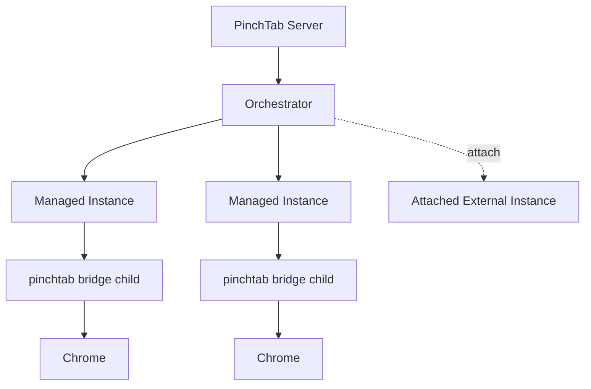
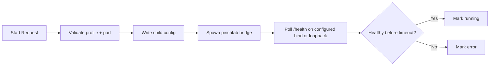
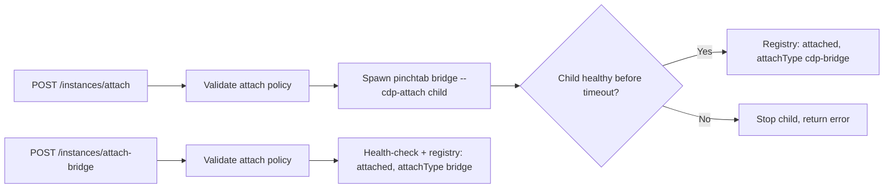
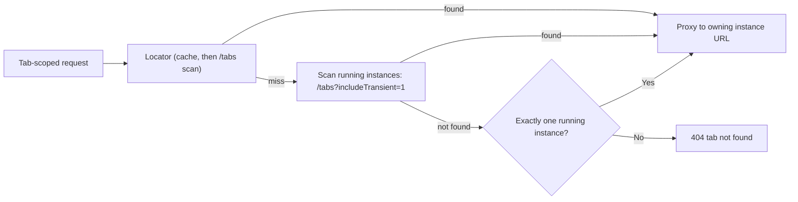
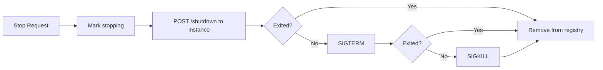

# Orchestration

This page describes the current orchestration layer in PinchTab: how the server launches, tracks, routes to, and stops browser instances.

## Scope

The orchestrator is part of server mode. It is responsible for:

- launching managed instances as child `pinchtab bridge` processes
- attaching externally managed Chrome instances when attach policy allows it
- tracking instance status and metadata
- routing tab-scoped requests to the owning managed instance
- stopping managed instances and cleaning up registry state

It does not execute browser actions directly. That work happens inside the bridge runtime.

## Current Runtime Shape

## Launch Flow

For a managed instance, the orchestration flow is:

What the code does today:

- validates the profile name before launch
- allocates a port when one is not supplied
- prevents more than one active managed instance per profile
- prevents reusing a port already in use
- writes a child config file under the profile state directory
- launches `pinchtab bridge`
- polls `/health` on the configured child bind first when present, then falls
  back to `127.0.0.1`, `::1`, and `localhost`
- moves the instance from `starting` to `running` or `error`

## Attach Flow

Attach is a separate path for an already running browser or bridge.

Current attach behavior:

- requires `security.attach.enabled`
- validates the URL against `security.attach.allowSchemes`
- validates the host against `security.attach.allowHosts`
- `POST /instances/attach` (CDP URL) launches a child `pinchtab bridge --cdp-attach <url>` on an allocated port, waits for its `/health`, and registers it as `attached: true`, `attachType: "cdp-bridge"`
- `POST /instances/attach-bridge` registers an already running bridge server as `attachType: "bridge"` (upserted by name when the token matches)
- never starts or kills the external Chrome process itself

## Routing Model

The orchestrator is also the routing layer for multi-instance server mode.

Today, tab routing (`routeByTabOwner` in `internal/orchestrator/route.go`) works like this:

- for routes such as `/tabs/{id}/navigate` and `/tabs/{id}/action`, the server resolves which instance owns the tab
- it first asks the instance locator (`internal/instance`), which checks its tab→instance cache and on a miss scans each running instance's user-facing `/tabs` list
- if that misses, the orchestrator scans running instances with `/tabs?includeTransient=1`, the unfiltered list that also contains tabs the UI list hides (for example `about:blank`, `file://`, or the instance's own port), and records the owner in the locator
- if no owner is found and exactly one instance is running, the request falls through to it; otherwise it returns 404
- a `browser` that conflicts with the owner's browser is rejected before proxying
- after resolution, it proxies the request to the owning instance's URL

Requests without a tab id go to the instance bound to the caller's session or agent identity when there is one, and otherwise to the active strategy's fallback, which targets the earliest-started running instance matching the requested or default browser (the `simple` strategy launches one when none is running). With no browser requested, that is the same instance `/health` reports as `defaultInstance` (`DefaultInstance()`).

This keeps the public server API stable while the bridge instances remain isolated. Attached instances (both attach types) expose a bridge HTTP URL, so they use the same proxy path.

## Stop Flow

Stopping a managed instance is a server-owned lifecycle operation.

Current stop behavior:

- marks the instance as `stopping`
- tries graceful shutdown through the instance HTTP API
- falls back to process-group termination when needed
- releases the allocated port
- removes the instance from the registry and locator cache

For CDP-attached instances, the child bridge is stopped the same way; the external Chrome is left running. For `attach-bridge` instances there is no child process: the orchestrator sends `POST /shutdown` to the registered bridge, waits for its endpoint to go away, and then removes the registration.

## Instance States

The main statuses surfaced today are:

- `starting`
- `running`
- `stopping`
- `stopped`
- `error`

The orchestrator also emits lifecycle events such as:

- `instance.launched`
- `instance.started`
- `instance.stopped`
- `instance.error`
- `instance.attached`
- `instance.reattached`

`Orchestrator.List()` returns instances ordered by start time (ties broken by ID), so listings are stable across calls.

## Relationship To Other Layers

- **Strategy layer** decides how shorthand requests are exposed or routed in server mode
- **Scheduler** is optional and sits above the same routed execution path
- **Bridge** owns browser state, tab state, and CDP execution
- **Profiles** provide persistent browser data on disk
